<div align="center">



<br/>

<h1>3x-ui Telegram VPN Bot</h1>

<p><b>VPN-подписки прямо в Telegram.</b> Бот продаёт доступ за Telegram&nbsp;Stars,<br/>
управляет клиентами в панели <a href="https://github.com/MHSanaei/3x-ui">3x-ui</a> и выдаёт <code>vless://</code>-ключи, QR-коды и Subscription&nbsp;URL.</p>

<p>
  
  
  
  
  
  
</p>

</div>

---

## ✨ Возможности

| | |
|---|---|
| 💳 **Оплата в Stars** | Продажа подписок за Telegram Stars — без внешних платёжных провайдеров. |
| 🔑 **Мгновенная выдача ключа** | После оплаты бот присылает `vless://`-ссылку, **QR-код** и **Subscription URL**. |
| 🧾 **Тарифы** | Гибкие планы: цена в Stars, длительность, лимит трафика. CRUD прямо из чата. |
| 🎟 **Промокоды** | Три типа: `percent` (скидка %), `flat_stars` (скидка в Stars), `free_days` (бесплатные дни). |
| 📦 **Несколько подписок** | Один пользователь может держать несколько активных подписок одновременно. |
| 🛠 **Админ-меню** | Тарифы, промокоды, карточки пользователей, статистика, рассылки — без доступа к серверу. |
| ⏱ **Фоновые задачи** | APScheduler следит за истечением подписок и снимает снапшоты трафика. |
| 🚀 **Установка в один скрипт** | `deploy/install-3x-ui.sh` ставит панель 3x-ui (VLESS+Reality), Let's Encrypt и самого бота. |

## 🔄 Как это работает

<div align="center">

```
 ┌──────────────┐   /start    ┌──────────────┐   REST API   ┌──────────────┐
 │  Пользователь │ ──────────▶ │ Telegram-бот  │ ───────────▶ │  3x-ui Panel  │
 │   в Telegram  │   Stars ⭐  │  (aiogram 3)  │   add client │  VLESS+Reality│
 └──────────────┘             └──────────────┘              └──────┬───────┘
        ▲                                                          │
        │      vless:// · QR-код · Subscription URL                │
        └──────────────────────────────────────────────────────────┘
```

</div>

1. Пользователь жмёт **«Купить подписку»**, выбирает тариф и (опционально) вводит промокод.
2. Бот выставляет счёт в **Telegram Stars** и ждёт оплату.
3. После успешного платежа бот создаёт клиента в **3x-ui** через REST API.
4. Пользователю прилетает **`vless://`-ссылка, QR-код и Subscription URL** — можно подключаться.

Локальное состояние (пользователи, тарифы, промокоды, подписки, платежи) живёт в **SQLite**;
актуальные клиенты — в панели 3x-ui.

## 🧱 Стек

- **Python 3.12** + [**aiogram 3.x**](https://docs.aiogram.dev/) — long polling.
- **aiosqlite** — БД. · **httpx** — REST к 3x-ui. · **qrcode[pil]** — QR.
- **APScheduler** — фоновые задачи. · **pydantic-settings** — конфиг из `.env`. · **loguru** — логи.

## 🚀 Быстрый старт

### Вариант A — всё одной командой (чистый Ubuntu/Debian)

Ставит панель **3x-ui** (с VLESS+Reality inbound), при FQDN — **Let's Encrypt** сертификат, и самого бота как systemd-сервис:

```bash
sudo bash <(curl -sSL https://raw.githubusercontent.com/<you>/3x-ui-tg-bot/main/deploy/install-3x-ui.sh) \
    --bot-token=1234567:ABCDEF \
    --admin-id=123456789 \
    --domain=vpn.example.com \
    --install-bot \
    --bot-repo=https://github.com/<you>/3x-ui-tg-bot.git
```

<details>
<summary><b>Что делает скрипт и какие есть флаги</b></summary>

<br/>

Скрипт самостоятельно:

- поставит 3x-ui из официального репозитория (отвечая на интерактивные вопросы установщика);
- задаст логин/пароль/порт/`webBasePath`;
- сгенерирует x25519-ключи Reality и создаст inbound;
- при `--ssl-mode=on` (включается автоматически, если `--domain` — это FQDN): поставит `certbot`, выпустит Let's Encrypt сертификат через HTTP-01 challenge на `:80` и пропишет пути в SQLite-настройках 3x-ui (`webCertFile`/`webKeyFile`/`subCertFile`/`subKeyFile`) — панель и subscription-сервер сразу работают по HTTPS **без reverse-proxy**. Renewal-hook (`/etc/letsencrypt/renewal-hooks/deploy/restart-x-ui.sh`) перезапускает x-ui после `certbot renew`;
- запишет готовый `.env` для бота с корректными `XUI_BASE_URL`, `XUI_SUB_BASE_URL`, `XUI_VERIFY_SSL`;
- по флагу `--install-bot` склонирует репозиторий, создаст venv и поднимет бота как systemd-сервис.

Полезные флаги:

- `--ssl-mode=auto|on|off` — `auto` (по умолчанию): FQDN → выпускается LE-сертификат, IP → панель остаётся HTTP-only (`XUI_VERIFY_SSL=false`).
- `--le-email=<addr>` — email для Let's Encrypt. Если не задан, сертификат выпускается с `--register-unsafely-without-email`.

Полное описание аргументов, troubleshooting и обновление — в [`deploy/install-3x-ui.md`](./deploy/install-3x-ui.md).

</details>

### Вариант B — локальный запуск

```bash
git clone <repo-url> 3x-ui-tg-bot
cd 3x-ui-tg-bot

python3.12 -m venv .venv
source .venv/bin/activate     # macOS / Linux
pip install -e .

cp .env.example .env
# заполните переменные в .env (минимум BOT_TOKEN, XUI_*)

python -m app.main
```

После запуска отправьте боту `/start` — он должен ответить приветствием.

## ⚙️ Конфигурация

Все переменные читаются из `.env` (`pydantic-settings`). Шаблон — [`.env.example`](./.env.example).

### Обязательные

| Переменная          | Назначение                                                              |
|---------------------|-------------------------------------------------------------------------|
| `BOT_TOKEN`         | Токен бота от [@BotFather](https://t.me/BotFather).                     |
| `ADMIN_IDS`         | CSV Telegram-ID администраторов: `123,456`. Доступ к админ-меню.        |
| `XUI_BASE_URL`      | База URL панели 3x-ui, например `https://panel.example.com:2053`.       |
| `XUI_USERNAME`      | Логин панели (используется для `/login`).                               |
| `XUI_PASSWORD`      | Пароль панели.                                                          |
| `XUI_INBOUND_ID`    | ID inbound'а, в котором бот создаёт/обновляет клиентов.                 |
| `XUI_SERVER_HOST`   | Публичный хост в `vless://`-ссылках (то, что видит конечный клиент).    |
| `XUI_SUB_BASE_URL`  | База URL Subscription-страниц 3x-ui, например `https://.../sub`.        |

### Необязательные

| Переменная        | По умолчанию      | Назначение                                              |
|-------------------|-------------------|---------------------------------------------------------|
| `DB_PATH`         | `./data/bot.db`   | Путь к файлу SQLite.                                    |
| `XUI_VERIFY_SSL`  | `true`            | Проверять TLS-сертификат панели. `false` — для self-signed. |
| `LOG_LEVEL`       | `INFO`            | Уровень логирования (`DEBUG`/`INFO`/`WARNING`/`ERROR`). |

## 📖 Использование

<details>
<summary><b>👤 Пользователь</b></summary>

<br/>

1. Отправить `/start` боту → откроется главное меню.
2. **«Купить подписку»** → выбрать тариф → ввести промокод (опционально) → подтвердить → оплатить через Telegram Stars.
3. После успешной оплаты бот пришлёт:
   - `vless://...` ссылку,
   - QR-код для импорта в XRay-клиент,
   - Subscription URL (можно подключить как «подписку» в клиенте).
4. **«Моя подписка»** → текущий статус (тариф, остаток дней, трафик), повторная выдача ключа, продление.
5. **«Активировать промокод»** → ввод кода (для `free_days` — даёт бесплатные дни подписки; `percent`/`flat_stars` применяются на этапе покупки тарифа).

</details>

<details>
<summary><b>🛠 Администратор</b></summary>

<br/>

Доступ — только для Telegram-ID из `ADMIN_IDS`.

1. `/start` → видно меню «Админ».
2. **Тарифы** → создать (название, цена в Stars, длительность в днях, лимит трафика), редактировать, активировать/деактивировать.
3. **Промокоды** → создать тип (`percent` / `flat_stars` / `free_days`), задать значение, лимит использований, срок действия.
4. **Пользователи** → найти юзера, увидеть подписку и потреблённый трафик.
5. **Статистика** → сводка по платежам и промокодам.

</details>

## 🖥 Деплой (systemd)

Файл сервиса — [`deploy/tg-vpn-bot.service`](./deploy/tg-vpn-bot.service).

<details>
<summary><b>Шаги установки</b></summary>

<br/>

```bash
# 1. Создать системного пользователя для бота (домашняя директория — место проекта).
sudo useradd -r -m -d /opt/3x-ui-tg-bot -s /bin/bash tgbot

# 2. Склонировать репозиторий в /opt/3x-ui-tg-bot (от имени tgbot).
sudo -u tgbot git clone <repo-url> /opt/3x-ui-tg-bot
cd /opt/3x-ui-tg-bot

# 3. Создать виртуальное окружение и поставить зависимости.
sudo -u tgbot python3.12 -m venv /opt/3x-ui-tg-bot/.venv
sudo -u tgbot /opt/3x-ui-tg-bot/.venv/bin/pip install -e .

# 4. Подготовить .env.
sudo -u tgbot cp /opt/3x-ui-tg-bot/.env.example /opt/3x-ui-tg-bot/.env
sudo -u tgbot ${EDITOR:-nano} /opt/3x-ui-tg-bot/.env
# Заполнить минимум BOT_TOKEN, ADMIN_IDS, XUI_*.
sudo chmod 600 /opt/3x-ui-tg-bot/.env
sudo chown tgbot:tgbot /opt/3x-ui-tg-bot/.env

# 5. Установить systemd unit.
sudo cp /opt/3x-ui-tg-bot/deploy/tg-vpn-bot.service /etc/systemd/system/
sudo systemctl daemon-reload

# 6. Запустить и включить автозагрузку.
sudo systemctl enable --now tg-vpn-bot

# 7. Проверить статус и логи.
sudo systemctl status tg-vpn-bot
sudo journalctl -u tg-vpn-bot -f
```

</details>

<details>
<summary><b>Обновление</b></summary>

<br/>

```bash
cd /opt/3x-ui-tg-bot
sudo -u tgbot git pull
sudo -u tgbot /opt/3x-ui-tg-bot/.venv/bin/pip install -e .
sudo systemctl restart tg-vpn-bot
```

</details>

<details>
<summary><b>Бэкап SQLite</b></summary>

<br/>

База SQLite живёт по пути из `DB_PATH` (по умолчанию `./data/bot.db`, при деплое — `/opt/3x-ui-tg-bot/data/bot.db`). Делайте регулярный бэкап:

```bash
# Безопасный snapshot через SQLite Online Backup API
sudo -u tgbot sqlite3 /opt/3x-ui-tg-bot/data/bot.db \
    ".backup '/var/backups/tg-vpn-bot-$(date +%F).db'"

# Cron (ежедневно в 03:00, хранить 30 дней)
sudo crontab -e
# 0 3 * * * sqlite3 /opt/3x-ui-tg-bot/data/bot.db ".backup '/var/backups/tg-vpn-bot-$(date +\%F).db'" && find /var/backups -name 'tg-vpn-bot-*.db' -mtime +30 -delete
```

Также имеет смысл бэкапить `.env` (вне публичных репозиториев).

</details>

## 📋 Требования

- **Python 3.12+** (см. `requires-python` в [pyproject.toml](./pyproject.toml)).
- **systemd** (для серверного деплоя) — Ubuntu 22.04/24.04, Debian 12+ и т.п.
- Развёрнутая **панель 3x-ui** с доступом к REST API (`/panel/api/inbounds/...`) и созданным inbound'ом, в котором бот будет управлять клиентами.
- Telegram-бот, созданный через [@BotFather](https://t.me/BotFather), с включёнными Stars-платежами.

## 🗂 Структура проекта

См. [architecture.md](./architecture.md) — там описан каждый файл и его назначение.

## ✅ E2E чек-лист

Перед промо-релизом или после крупных изменений прогоняется ручной end-to-end сценарий на staging-инстансе 3x-ui и dev-аккаунте Telegram-бота. Шаги — в [docs/e2e-checklist.md](./docs/e2e-checklist.md).

## 📄 Лицензия

Распространяется под лицензией **MIT** (см. поле `license` в [pyproject.toml](./pyproject.toml)).
